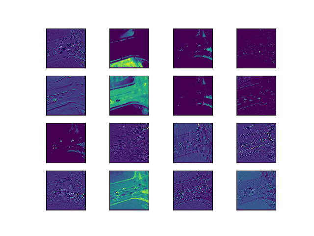

# Visualization-of-activations-features-of-CNN-layers-
In this repository I will show you how we can visualize the features extracted from the intermediate convolutional layers form different models in keras models.

PRE REQUISITES:
1. Tensorflow 
2. Keras
3. Python

Please make sure that you download the weights of the pre-trained models from this repository and paste these weights files in C:/Users/yourname/ .keras/models/ directory. 

INPUT IMAGE

Visualization of the features/activations from the convolutional layers in the RESNET 50 CNN network

Visualization of the Feature Maps Extracted from block 1 in the RESNET_50 model

Visualization of the Feature Maps Extracted from block 2 in the RESNET_50 model

Visualization of the Feature Maps Extracted from block 3 in the RESNET_50 model

Visualization of the Feature Maps Extracted from block 4 in the RESNET_50 model

Visualization of the Feature Maps Extracted from block 5 in the RESNET_50 model

Observations to be made: 
